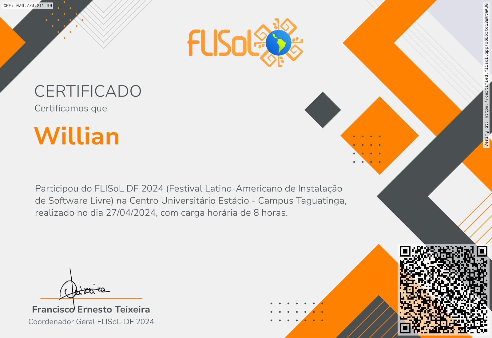

# 📜 Certificações Profissionais

Este repositório reúne minhas certificações em diversas áreas da tecnologia, como **Programação para Internet**, **Python**, **Power BI**, **Análise de Dados para Tomada de Decisões**, **Desenvolvimento Rápido de Aplicações em Python para Cloud, IoT e Big Data**, além da participação em eventos como o **FLISoL**.

Todos os certificados estão disponíveis para visualização e download.

---

## 📂 Certificados

### 💻 Programação para Internet
- 📄 [`Certificado de Programação para Internet`](./Programação%20Para%20Internet.pdf)

---

### 📊 Power BI
- 📄 [`Certificado de Power BI`](./Validação%20Certificado%20PowerBi.pdf)

---

### 🐍 Python
- 📄 [`Certificado de Python`](./Validação%20Certificado%20Python.pdf)

---

### 📈 Análise de Dados para Tomada de Decisões
- 📄 [`Certificado de Análise de Dados`](certificados-img/Analise_de_dados.png)

---

### ☁️ Desenvolvimento Rápido de Aplicações em Python para Cloud, IoT e Big Data
- 📄 [`Certificado de Desenvolvimento em Python para Cloud, IoT e Big Data`](./Desenvolvimento%20Rapido%20de%20Aplicacoes%20em%20Python%20para%20Cloud%20IoT%20e%20BigData.pdf)

---

### 🌐 Evento – FLISoL
- 🖼️ 

---

## ✨ Observações

- Todos os certificados são **oficiais, válidos e verificáveis**.
- Os arquivos em PDF podem ser baixados ou visualizados diretamente no navegador.

---

## 📫 Contato

Caso deseje validar algum certificado ou saber mais sobre minha formação, estou à disposição!
