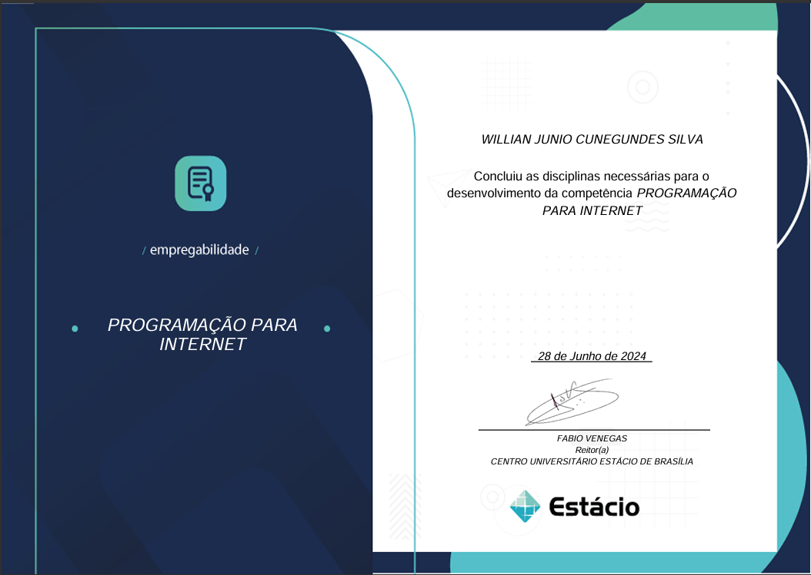
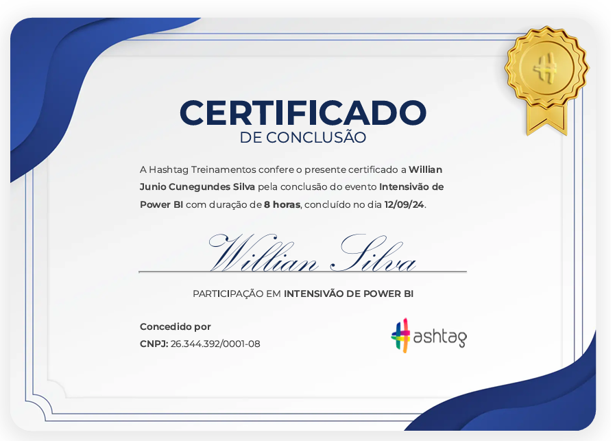
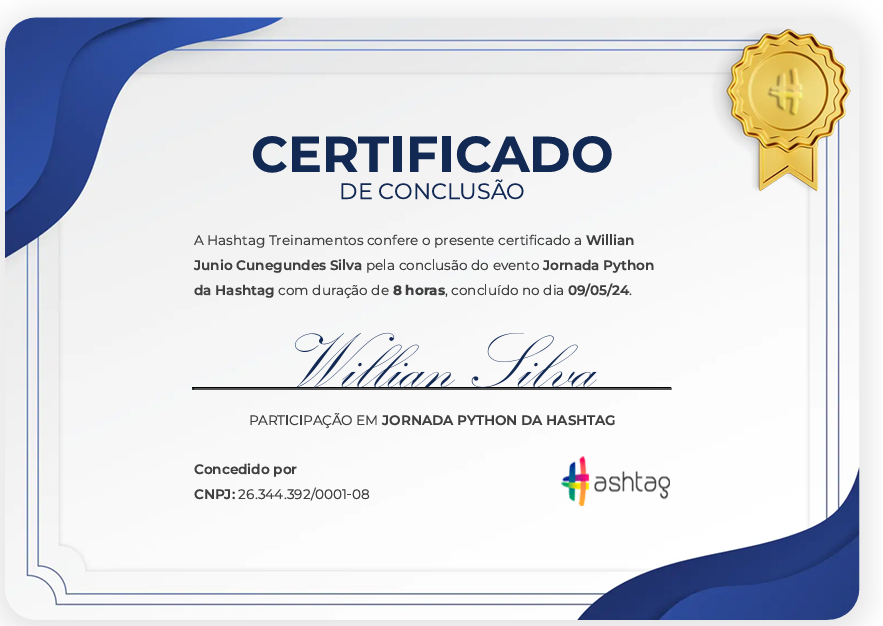
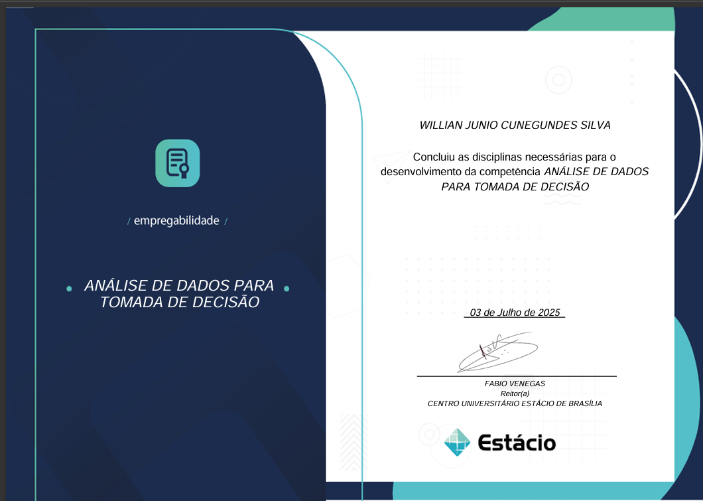
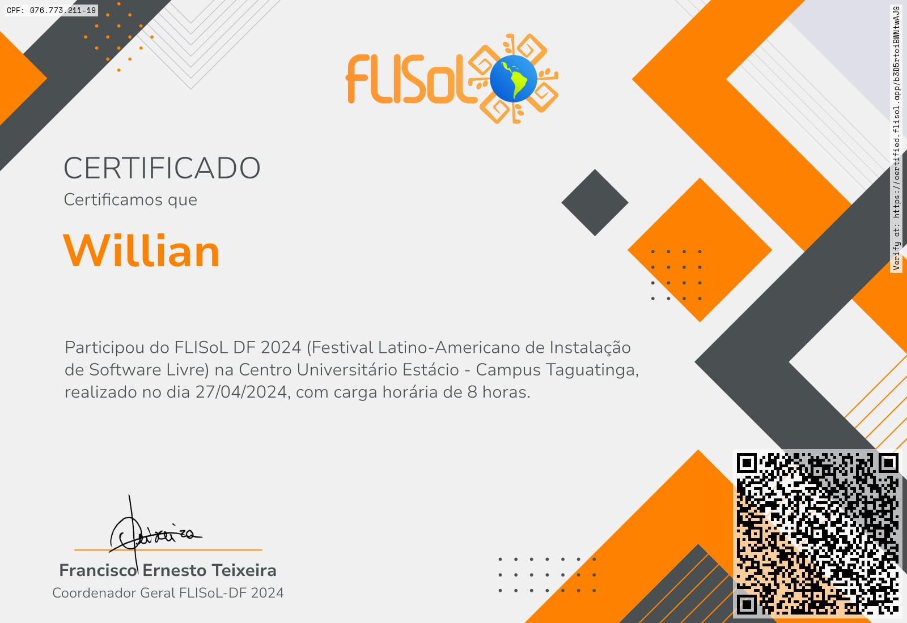
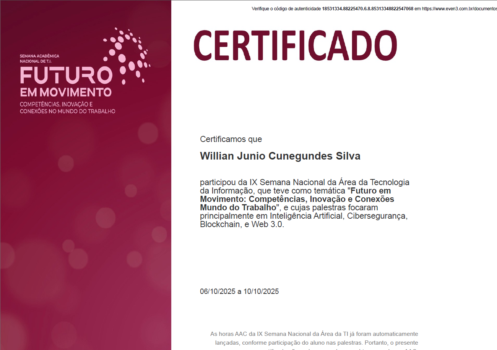

# 📜 Certificações Profissionais

Este repositório reúne minhas certificações em diversas áreas da tecnologia, como **Programação para Internet**, **Python**, **Power BI**, **Análise de Dados para Tomada de Decisões**, **Desenvolvimento Rápido de Aplicações em Python para Cloud, IoT e Big Data**, além da participação em eventos como o **FLISoL**.

Todos os certificados estão disponíveis para visualização e download.

---

## 📂 Certificados

### 💻 Programação para Internet

---

### 📊 Power BI

---

### 🐍 Python – Jornada Python

---

### 📈 Análise de Dados para Tomada de Decisões

---

### ☁️ Desenvolvimento Rápido de Aplicações em Python para Cloud, IoT e Big Data

---

### 🌐 Evento – FLISoL

### 💻 Programação de Sistemas de Informação

---

### 🚀 Futuro em Movimento

### 🗄️ Gerência, Organização e Recuperação das Informações

### 🤖 Imersão Agentes de IA

## ✨ Observações

- Todos os certificados são **oficiais, válidos e verificáveis**.
- Os arquivos também estão disponíveis em PDF neste repositório (opcionalmente, você pode adicioná-los junto com as imagens).

---

## 📫 Contato

Caso deseje validar algum certificado ou saber mais sobre minha formação, estou à disposição!
